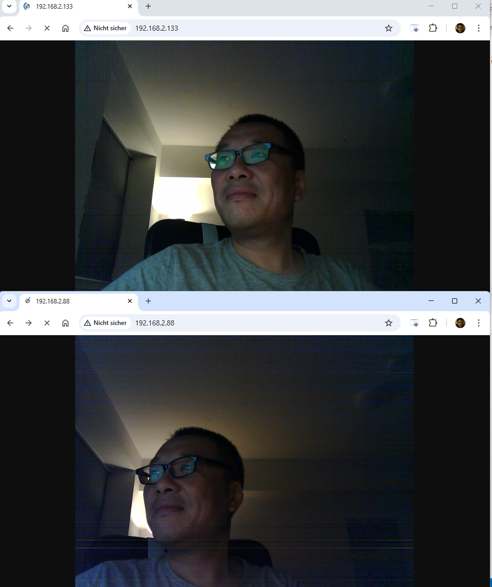

# ESP32_CAM
Hobby Projects mainly with 2 ESP32 CAM

# Flash Test
use https://sparks.gogo.co.nz/assets/_site_/downloads/CH34x_Install_Windows_v3_4.zip flash works for Arduino IDE and Platform IO

1. Press hold IOD button on uploader board
2. Press Reset button on  esp32 CAM board (reset on uploader board not work)
3. Release reset button at first and then the IOD button 

# CAM Code Test

http://192.168.2.88
esp32-9DBF24.sphairon.box
ec:62:60:9d:bf:24

http://192.168.2.133
esp32-9B2468.sphairon.box
c8:f0:9e:9b:24:68

# Install OpenCV on venv

C:\Users\tomya\my_project

venv\Scripts\activate

deactivate

Check possible interaction with leo Chen

